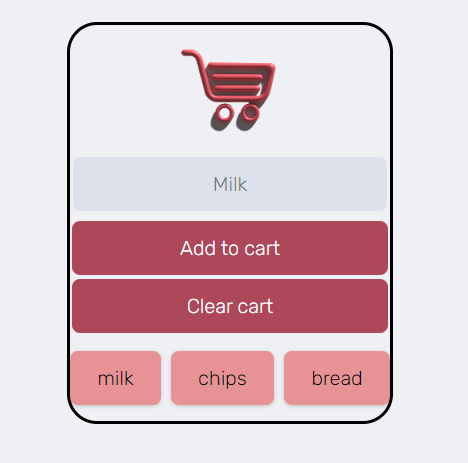

# ShopList

Shoplist - Your Shopping List App
Shoplist is a simple and intuitive mobile app designed to help you remember the things you need to buy, ensuring you never forget an essential item during your shopping trips. With a clean and user-friendly interface, Shoplist is your ultimate shopping companion, built with HTML, CSS, and JavaScript.

# Features
Effortless Item Management: Add, edit, and remove items from your shopping list with just a few taps.
Organize Your List: Categorize items or create multiple lists to streamline your shopping experience.
Smart Suggestions: Get suggestions for common items as you type, making list creation a breeze.
Cross-Device Sync: Access your shopping lists from anywhere, as Shoplist syncs seamlessly across devices.
One-Click Shopping: Mark items as purchased with a single touch, keeping your list up to date.

# Screenshots

 # Getting Started
To get started with Shoplist, follow these simple steps:

Clone the Repository: git clone https://github.com/soufianchk/shoplist.git
Open index.html: Open the index.html file in your web browser or deploy it on your preferred web hosting platform.
# Contributing
We welcome contributions to improve Shoplist! Feel free to submit issues and pull requests.

# Authors
Shoplist is developed and maintained by Soufian Chakkouri.

# License
This project is licensed under the MIT License. See the LICENSE file for details.

# Support
If you have any questions or encounter issues, please contact our support team at support@shoplistapp.com.

# Acknowledgments
Shoplist is inspired by the need for a simple and effective shopping list app.

Thank you for using Shoplist!

Enjoy using Shoplist, and happy shopping!